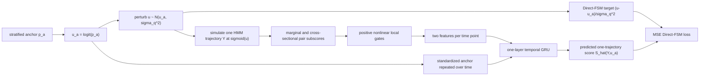
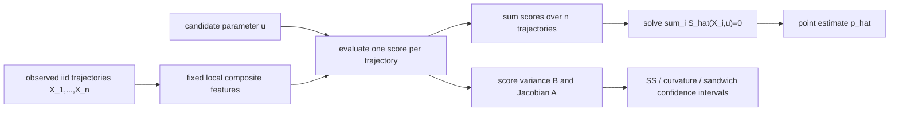

# 单参数非线性 emission HMM：方法、实验设置与结果

日期：2026-07-20  
状态：与当前代码和已保存实验产物逐项核对后的完整技术说明  
主参数：固定 $p_{01}=0.06$，只推断 $p_{11}$

---

## 1. 文档目的与结论摘要

本文档完整描述当前表现最清楚的单参数 HMM 版本：

1. 数据生成模型以及什么才算一个 observation；
2. 如何从 marginal/pairwise composite subscores 构造有序序列特征；
3. positive nonlinear local gate、GRU 和 Direct-FSM 如何组成 Stage 1；
4. 训练时到底输入了什么、没有输入什么；
5. 如何用 learned score 做 point estimation 和 frequentist confidence interval；
6. 可选的 Stage-2 pilot-plus-score NPE 如何近似 posterior；
7. linear ablation、Jiang official baseline 和 architecture/NPE ablation 如何设置；
8. 当前可以支持什么结论，以及哪些更强的结论还不能支持。

最简洁的结果是：在三个独立 Stage-1 训练种子上，nonlinear gate 相对
matched linear-local GRU 将 exact-score 标准化 MSE 平均降低 **26.9%**；在
固定 learned networks 后的 100-dataset score-root 实验中，pooled RMSE
降低 **11.8%**；在以 exact posterior 为参照的 Stage-2 实验中，posterior
mean RMSE 降低 **17.1%**、Wasserstein-1 距离降低 **21.3%**。

需要同时保留两个限制：

- 三个 score-root 训练种子中有一个种子的 gated root 比 linear 差；
- 本方法使用已知 emission 模型得到 analytic local likelihood ratios，因而
  不是一个只允许访问黑箱 simulator 的完全对称 Jiang benchmark。

本文中的 proposed arm 是：

```text
cross-sectional marginal/pairwise emission subscores
    -> separate positive nonlinear gates
    -> per-time coordinate/pair averaging
    -> anchor-conditioned temporal GRU
    -> learned one-trajectory likelihood score
```

它不是 “Antithetic Khoo”，也没有使用 antithetic sampling。

### 阅读导航

- [数据单位与 DGP](#2-三种不同的数据单位必须先区分)
- [Direct-FSM 与 learned-score target](#5-参数坐标与-anchored-direct-fsm)
- [marginal/pairwise composite features](#6-stage-1-local-composite-features)
- [nonlinear gate、GRU 与 strict nesting](#7-matched-linear-baseline-与-proposed-nonlinear-model)
- [正式训练配置](#8-stage-1-正式训练协议)
- [score root 与 confidence intervals](#10-从-learned-score-得到-frequentist-point-estimator)
- [Stage-2 posterior](#12-可选-stage-2pilot-plus-frozen-score-npe)
- [Jiang baseline](#132-jiang-published-architecture-baseline)
- [正式结果](#15-正式结果stage-1-exact-score-approximation)
- [fairness 与限制](#21-fairness限制与报告纪律)
- [复现命令和产物](#22-reproducibility-commands)

---

## 2. 三种不同的数据单位：必须先区分

这套实验里“训练样本”“observation”和“observed dataset”容易混淆。

### 2.1 一条完整轨迹是一个 outer observation

第 $i$ 个 outer observation 为

$$
X_i=Y_i=(Y_{i1},\ldots,Y_{iT}),
\qquad
Y_{it}\in\mathbb R^m.
$$

正式设置中

$$
T=50,
\qquad
m=10,
$$

因此一条轨迹的 raw shape 是 $50\times10$，flatten 后为 500 维。
同一条轨迹内部存在 HMM 时间依赖；它的 500 个数不是 500 个 iid
observations。

### 2.2 一个 frequentist observed dataset 有 $n=100$ 条独立轨迹

score-root 和 confidence-interval 实验使用

$$
X_n^*=(X_1^*,\ldots,X_n^*),
\qquad n=100,
$$

其中不同 $X_i^*$ 是在相同参数下独立模拟的完整轨迹。因此 Jiang 所需的
outer iid/additive-score 条件在这一层成立：

$$
S(\theta;X_n^*)
=\sum_{i=1}^n S(\theta;X_i^*).
$$

### 2.3 Stage-1 training table 的一行不是一个 $n=100$ dataset

Stage 1 的 40,000 个 training rows 中，每一行包含：

```text
一个 anchor parameter
+ 一次 Gaussian parameter perturbation
+ 在 perturbed parameter 下生成的一条完整 HMM trajectory
+ 一个 likelihood-free Direct-FSM regression target
```

所以 Stage-1 training size 40,000 表示 40,000 条独立的完整轨迹，每条轨迹
通常对应不同的 anchor/perturbed parameter；不是 40,000 个各含 100 条轨迹
的 observed datasets。

### 2.4 Stage 2 又是单轨迹 posterior 问题

Stage-2 posterior evaluation 将一条 $50\times10$ 轨迹作为一次观测，针对
该轨迹近似

$$
p(p_{11}\mid Y).
$$

这和 $n=100$ 的 score-root/confidence-set 实验是两个不同 estimands，不应
把两者的 RMSE 或区间宽度直接混为一谈。

---

## 3. 数据生成模型

### 3.1 隐状态与转移矩阵

令

$$
B_{it}\in\{0,1\},
\qquad t=1,\ldots,T.
$$

初始状态为

$$
B_{i1}\sim\operatorname{Bernoulli}(0.5).
$$

转移矩阵写作

$$
P(p)=
\begin{pmatrix}
1-p_{01} & p_{01}\\
1-p & p
\end{pmatrix},
$$

其中

$$
p_{01}=0.06\quad\text{固定},
\qquad
p=p_{11}\quad\text{未知}.
$$

参数范围和真值为

$$
p\in[0.80,0.99],
\qquad
p^*=0.94.
$$

在真值处 $P_{00}=P_{11}=0.94$，且 stationary state-one probability 为

$$
\frac{p_{01}}{p_{01}+1-p_{11}}
=\frac{0.06}{0.06+0.06}=0.5,
$$

与初始概率 0.5 一致。轨迹平均处于两个状态的时间相近，但状态具有较强
persistence。

### 3.2 非线性 sparse scale-mixture emission

给定状态 $B_{it}=0$，十个坐标独立满足

$$
Y_{itj}\mid B_{it}=0\sim N(0,1),
\qquad j=1,\ldots,m.
$$

给定状态 $B_{it}=1$，每个坐标独立满足

$$
Y_{itj}\mid B_{it}=1
\sim
(1-\rho)N(0,1)+\rho N(0,a^2),
$$

正式实验取

$$
\rho=0.20,
\qquad
a=3.
$$

这里的 mixture indicator 是逐 coordinate、逐 time、逐 trajectory 独立产生
的；不是整条轨迹共享一个 tail indicator。

代码中的 `HMMConfig.tau=0.5` 是从旧 common-factor HMM 配置继承的字段，
在这个 sparse scale-mixture simulator 和 feature construction 中不参与
计算。真正控制本实验 emission 的参数是 $(\rho,a)=(0.2,3)$。

### 3.3 单坐标 likelihood ratio

记标准正态密度为 $\phi_1$，标准差为 $a$ 的正态密度为 $\phi_a$。状态
1 相对状态 0 的单坐标 likelihood ratio 为

$$
r(y)
=\frac{(1-\rho)\phi_1(y)+\rho\phi_a(y)}{\phi_1(y)}
=(1-\rho)+\frac{\rho}{a}
\exp\left\{
\frac{y^2}{2}\left(1-a^{-2}\right)
\right\}.
$$

相应 log likelihood ratio 为

$$
\ell(y)=\log r(y).
$$

在正式设置中

$$
\ell(y)
=\log\left[
0.8+\frac{0.2}{3}
\exp\left\{\frac{4}{9}y^2\right\}
\right].
$$

一个时间点十个坐标的完整 emission evidence 为

$$
L_t
=\log\frac{f_1(Y_t)}{f_0(Y_t)}
=\sum_{j=1}^{10}\ell(Y_{tj}).
$$

大 $|y|$ 下 $\ell(y)$ 近似按 $y^2$ 增长，因此少量 tail coordinates
会携带很强 evidence。这正是本 DGP 用来检验 nonlinear local calibration
的机制。

### 3.4 exact likelihood 和 exact score 的角色

由于 $L_t$ 可解析计算，forward algorithm 可以得到 exact HMM likelihood，
forward-backward algorithm 可以得到 exact observed transition score。

若 $N_{11}$ 和 $N_{10}$ 表示 latent transition counts，则在

$$
u=\operatorname{logit}(p)
$$

坐标中，单轨迹 exact score 可写为

$$
S_u^*(Y;p)
=(1-p)\,\mathbb E_p[N_{11}\mid Y]
-p\,\mathbb E_p[N_{10}\mid Y].
$$

实现中利用 forward-backward posterior transition probabilities 计算该值。
但 exact likelihood/score 只用于：

- Stage-1 score diagnostic；
- exact MLE evaluation；
- exact posterior evaluation；
- 测试有限差分和实现正确性。

它们从不作为 Stage-1 regression target，也不进入 learned-score root 或
NPE training context。

---

## 4. 方法总览

### 4.1 Stage-1 training flow



### 4.2 Deployment flow



---

## 5. 参数坐标与 anchored Direct-FSM

### 5.1 为什么在 logit 坐标中训练

使用

$$
u=\operatorname{logit}(p)
=\log\frac{p}{1-p},
\qquad
p=\operatorname{sigmoid}(u).
$$

这样 Gaussian proposal 可以在无约束的 $u$-space 中定义，同时始终保证
模拟参数 $p\in(0,1)$。所有 Stage-1 targets 和 reported exact-score MSE
均对应 $u$-score。

### 5.2 anchor sampling

每个训练 row 先在 physical parameter interval 内做连续 stratified sampling：

$$
p_a\in[0.80,0.99],
\qquad
u_a=\operatorname{logit}(p_a).
$$

40,000 个 anchors 各占一个随机打乱的等宽 stratum，而不是简单从均匀分布
中有放回抽样。这让整个 deployment interval 的覆盖更均匀。

### 5.3 Gaussian perturbation 和 likelihood-free target

给定 anchor，采样

$$
u\mid u_a\sim N(u_a,\sigma_q^2),
\qquad
\sigma_q=0.25,
$$

再令 $p=\operatorname{sigmoid}(u)$，并从 simulator 生成一条轨迹

$$
Y\sim P_{\operatorname{sigmoid}(u)}.
$$

Direct-FSM target 为

$$
T_{\mathrm{FSM}}
=\nabla_{u_a}\log q_{\sigma_q}(u\mid u_a)
=\frac{u-u_a}{\sigma_q^2}.
$$

训练目标为

$$
\mathcal L_{\mathrm{FSM}}(\omega)
=\mathbb E\left[
\left{
\widehat S_\omega(Y,u_a)
-\frac{u-u_a}{\sigma_q^2}
\right}^2
\right].
$$

这个 loss 不需要 $\nabla_u\log p(Y\mid u)$，也不需要 full likelihood。

### 5.4 population target 是 smoothed likelihood score

定义 Gaussian-smoothed likelihood

$$
m_{\sigma_q}(Y\mid u_a)
=\int p(Y\mid u)q_{\sigma_q}(u\mid u_a)\,du.
$$

由 Fisher/denoising identity，population regression function 为

$$
\mathbb E\left[
\left.
\frac{u-u_a}{\sigma_q^2}
\right|Y,u_a
\right]
=\nabla_{u_a}\log m_{\sigma_q}(Y\mid u_a).
$$

因此当前 Stage 1 严格地说学习的是 smoothed score field，而不是有限
$\sigma_q$ 下完全无偏的 exact likelihood score。exact-score test error 包含：

1. 由 $\sigma_q=0.25$ 引入的 smoothing bias；
2. feature representation error；
3. neural approximation 与 optimization error。

linear 和 nonlinear arms 使用相同 $\sigma_q$，所以 matched ablation 仍然
有效，但不应把二者与 exact MLE 的差距全部归因于网络。

---

## 6. Stage-1 local composite features

### 6.1 固定 reference mixture probability

构造 local emission subscores 时使用

$$
\pi_{\mathrm{ref}}=0.30.
$$

这是一个固定的 feature-map reference constant，不是：

- HMM transition parameter $p_{11}$；
- Stage-2 prior；
- 真实参数 $p^*$；
- inference 时需要搜索的 candidate parameter。

候选 $p$ 或 anchor $u_a$ 通过单独的 anchor input 进入 GRU。

### 6.2 marginal local subscore

对每个 $Y_{tj}$，定义

$$
w_{tj}^{(1)}
=\operatorname{sigmoid}
\left{
\operatorname{logit}(\pi_{\mathrm{ref}})+\ell(Y_{tj})
\right},
$$

$$
s_{tj}^{(1)}
=w_{tj}^{(1)}-\pi_{\mathrm{ref}}.
$$

它是一个 reference iid-mixture 的 $u$-score，仅用作 emission evidence
map。它不是 HMM 的 transition score。

每个时间点有 $m=10$ 个 marginal subscores，因此 raw marginal tensor shape
为

$$
[N,50,10].
$$

### 6.3 同一时间点的 cross-sectional pairwise subscore

对每个 unordered coordinate pair (j<k)，利用 conditional coordinate
independence 得到

$$
\ell_{tjk}^{(2)}
=\ell(Y_{tj})+\ell(Y_{tk}).
$$

定义

$$
s_{tjk}^{(2)}
=\operatorname{sigmoid}
\left{
\operatorname{logit}(\pi_{\mathrm{ref}})
+\ell_{tjk}^{(2)}
\right}
-\pi_{\mathrm{ref}}.
$$

每个时间点有

$$
\binom{10}{2}=45
$$

个 pairwise subscores，因此 tensor shape 为

$$
[N,50,45].
$$

这里的 pairwise 是同一 (t) 内坐标之间的 pair，不是相邻时间
((t-1,t)) 的 pair。后者只在 Stage-2 pilot 中使用。

### 6.4 为什么 bounded local score 需要 nonlinear calibration

未标准化 marginal score 满足

$$
s=w-\pi_{\mathrm{ref}},
$$

所以原始 log likelihood ratio 可以恢复为

$$
\ell
=\operatorname{logit}(s+\pi_{\mathrm{ref}})
-\operatorname{logit}(\pi_{\mathrm{ref}}).
$$

并且 $\ell$ 与 $s$ 同号，因此除 $s=0$ 外可写为

$$
\ell=s\,m^*(s),
$$

其中

$$
m^*(s)
=\frac{
\operatorname{logit}(s+\pi_{\mathrm{ref}})
-\operatorname{logit}(\pi_{\mathrm{ref}})
}{s}>0.
$$

这给出了 positive nonlinear multiplier 的结构动机。linear mean 只平均
bounded $s$，当少量 tail coordinates 产生非常大的 $\ell(y)$ 时会丢失
evidence magnitude；在平均前学习 nonlinear positive recalibration 可以
部分恢复该强度。

### 6.5 实际标准化顺序

实现先用 training set 的全局统计量分别标准化两个通道：

$$
z_{tj}^{(1)}
=\frac{s_{tj}^{(1)}-\mu_1}{\sigma_1},
\qquad
z_{tjk}^{(2)}
=\frac{s_{tjk}^{(2)}-\mu_2}{\sigma_2}.
$$

所有 validation/test/inference 数据都复用 frozen training statistics。
实际 gate 作用于 $z$，而不是未标准化 $s$。因此上面的 exact inverse
relation 是 architecture motivation，不应描述成代码在 finite network 下
显式地精确恢复了 $\ell$。实现所保证的是 positive multiplier 在标准化
坐标中不翻转输入符号。

---

## 7. Matched linear baseline 与 proposed nonlinear model

### 7.1 Linear-local GRU baseline

在每个时间点先做 coordinate/pair average：

$$
c_{t,1}^{\mathrm{lin}}
=\frac1{10}\sum_{j=1}^{10}z_{tj}^{(1)},
$$

$$
c_{t,2}^{\mathrm{lin}}
=\frac1{45}\sum_{j<k}z_{tjk}^{(2)}.
$$

将

$$
c_t^{\mathrm{lin}}
=(c_{t,1}^{\mathrm{lin}},c_{t,2}^{\mathrm{lin}})
$$

再用 training-set time-feature mean/SD 标准化。这里的 “linear” 只表示
aggregation 之前的 local map 是 identity；后面的 GRU 和 head 都是非线性
的，所以它不是全局线性模型。

### 7.2 Positive nonlinear local gates

proposed arm 对两个通道使用互不共享参数的 gates：

$$
g_{tj}^{(1)}
=z_{tj}^{(1)}m_{\eta_1}(z_{tj}^{(1)}),
$$

$$
g_{tjk}^{(2)}
=z_{tjk}^{(2)}m_{\eta_2}(z_{tjk}^{(2)}),
$$

且

$$
m_{\eta_r}(z)
=\operatorname{softplus}
\left\{
\operatorname{MLP}_{\eta_r}(z)
\right\}>0.
$$

每个 multiplier MLP 为

```text
1 -> 16 -> SiLU -> 16 -> SiLU -> 1 -> softplus
```

它只接收 signed standardized local subscore $z$，不接收 anchor。anchor
dependence 由后面的 GRU 处理。gated per-time features 为

$$
c_{t,1}^{\mathrm{gate}}
=\frac1{10}\sum_j g_{tj}^{(1)},
$$

$$
c_{t,2}^{\mathrm{gate}}
=\frac1{45}\sum_{j<k}g_{tjk}^{(2)}.
$$

两者使用与 linear arm 相同的 frozen time-feature normalization constants。

### 7.3 Temporal GRU

anchor 也用 training-set statistics 标准化：

$$
\widetilde u_a
=\frac{u_a-\mu_u}{\sigma_u}.
$$

在每个时间点送入 GRU 的向量为

$$
x_t=(\widetilde c_{t,1},\widetilde c_{t,2},\widetilde u_a)
\in\mathbb R^3.
$$

同一个 $\widetilde u_a$ 被重复到全部 50 个时间点。网络为：

```text
one-layer, one-direction GRU
input dimension 3
hidden dimension 64
take final hidden state h_50
64 -> SiLU -> 1 head
```

输出

$$
\widehat S(Y,u_a)\in\mathbb R
$$

是“一条完整轨迹”的 learned $u$-score。它不是每个 time point 的 score
之和；GRU 自己学习如何利用顺序和 persistence。只有多个独立 outer
trajectories 组成 observed dataset 时，才在 trajectory 这一层求和。

### 7.4 参数量

| Arm | Trainable parameters |
|---|---:|
| Linear-local GRU | 17,473 |
| Nonlinear-gate GRU | 18,115 |
| 每个 positive gate | 321 |

gated arm 比 linear 多 642 个参数，约增加 3.7%。这部分 capacity difference
是方法本身的一部分；matched attribution 依赖 strict nesting，而不是参数量
完全相同。

### 7.5 Strict nesting

每个 gate 的最后一层 weight 初始化为 0，bias 选择为

$$
\log(e^1-1),
$$

因此初始化时

$$
m_{\eta_1}(z)=m_{\eta_2}(z)=1.
$$

先完整训练 linear model，再把 linear GRU/core 权重逐项复制到 gated model。
所以 gate training 开始前

$$
\widehat S_{\mathrm{gate}}(Y,u_a)
=\widehat S_{\mathrm{lin}}(Y,u_a)
$$

达到最大绝对误差 $<10^{-6}$ 的数值检查标准。

这一设计排除了“gated model 只是碰巧从更好的随机初始化开始”的解释。

---

## 8. Stage-1 正式训练协议

### 8.1 固定配置

| 项目 | 正式值 |
|---|---:|
| Unknown parameter | $p_{11}$ |
| Fixed transition | $p_{01}=0.06$ |
| Parameter interval | ([0.80,0.99]) |
| Evaluation truth | $p^*=0.94$ |
| Trajectory length | $T=50$ |
| Coordinates per time | $m=10$ |
| Initial state probability | 0.5 |
| Emission | $0.8N(0,1)+0.2N(0,3^2)$ in state 1 |
| Training trajectories | 40,000 |
| Validation trajectories | 8,000 |
| Proposal width | $\sigma_q=0.25$ in logit space |
| Reference emission mixture | $\pi_{\rm ref}=0.30$ |
| GRU hidden width | 64 |
| Gate hidden width | 16 |
| Maximum updates | 3,000 per arm |
| Gate-only phase | first 400 gated updates |
| Batch size | 512 |
| Linear learning rate | $3\times10^{-4}$ |
| Gate learning rate | $10^{-4}$ |
| Joint GRU learning rate | $5\times10^{-5}$ |
| AdamW weight decay | $10^{-3}$ |
| Gradient clipping | 5.0 |
| EMA decay | 0.995 |
| Validation check interval | 100 updates |
| Patience | 20 validation checks |
| Training seeds | 20260721, 20260722, 20260723 |

### 8.2 Optimization sequence

对每个 training seed：

1. 一次性生成共享的 40k training 和 8k validation cache；
2. 用 AdamW、learning rate $3\times10^{-4}$ 训练 linear model 最多 3,000
   updates；
3. 保存 raw/EMA 中 validation MSE 最低的 checkpoint；
4. 将该 linear core 复制到 identity-initialized gated model；
5. gated updates 1--400 只训练两个 gates，GRU learning rate 为 0；
6. updates 401--3000 同时训练 gates 和 GRU，learning rates 分别为
   $10^{-4}$ 和 $5\times10^{-5}$；
7. 每次 validation 同时比较 raw weights 和 EMA weights，保存较优者；
8. 最终恢复全程 validation MSE 最低的 checkpoint。

两个 arms 共享相同 cached trajectories、anchors、targets、标准化统计量和
maximum update count，但 mini-batch RNG offsets 不同，因此不声称每一步的
batch index 完全相同。

### 8.3 Tensor shapes

| Tensor | Shape |
|---|---|
| Raw trajectory | `[N, 50, 10]` |
| Marginal subscores | `[N, 50, 10]` |
| Cross-sectional pair subscores | `[N, 50, 45]` |
| Per-time aggregated sequence | `[N, 50, 2]` |
| Standardized anchor | `[N, 1]` |
| Direct-FSM target | `[N, 1]` |
| Predicted one-trajectory score | `[N, 1]` |

### 8.4 信息使用审计

| 信息 | Stage-1 train | Score-root inference | 仅 evaluation |
|---|:---:|:---:|:---:|
| Simulator output $Y$ | ✓ | ✓ | ✓ |
| Anchor/candidate $p$ | ✓ | ✓ | ✓ |
| Gaussian proposal target | ✓ |  |  |
| Known $(p_{01},\rho,a)$ | ✓ | ✓ | ✓ |
| Analytic marginal/pair emission LR | ✓ | ✓ | ✓ |
| True test parameter $p^*$ |  |  | ✓ |
| Latent states $B_t$ |  |  | 仅 simulator sanity check |
| Tail-mixture indicators |  |  |  |
| Exact full HMM score |  |  | ✓ |
| Exact full HMM likelihood |  |  | ✓ |
| Exact posterior |  |  | ✓ |

因此不存在 true-parameter、latent-state 或 exact-full-score target leakage。
但 analytic local emission likelihood ratio 是真实且重要的 model-structure
access，不能把本方法描述为完全 simulator-only 的黑箱方法。

---

## 9. Stage-1 score diagnostic

对每个 fitted checkpoint，在

$$
p\in\{0.84,0.90,0.94,0.97\}
$$

分别生成 2,000 条新轨迹。用 exact forward-backward score
$S_u^*(Y;p)$ 作为 test-only reference。

主要指标为

$$
\operatorname{stdMSE}(p)
=\frac{
\mathbb E[(\widehat S(Y,p)-S_u^*(Y,p))^2]
}{
\operatorname{Var}(S_u^*(Y,p))
}.
$$

它是无量纲指标；0 表示 exact recovery，约 1 对应接近 constant-mean
predictor 的误差量级。另报告 Pearson correlation，区分 score shape 与
整体 offset/scale error。

---

## 10. 从 learned score 得到 frequentist point estimator

### 10.1 固定真实观测，搜索 candidate parameter

给定

$$
X_n^*=(X_1^*,\ldots,X_n^*),
$$

local emission features 只由数据和固定 $\pi_{\rm ref}$ 计算一次。对任意
candidate $u$，网络用同一批 features 和 candidate anchor 计算

$$
\widehat S_n(u;X_n^*)
=\sum_{i=1}^n\widehat S(X_i^*,u).
$$

candidate $u$ 是 numerical search variable，不是已知真值。

估计量定义为

$$
\widehat u_n:
\widehat S_n(\widehat u_n;X_n^*)=0,
\qquad
\widehat p_n=\operatorname{sigmoid}(\widehat u_n).
$$

### 10.2 实际 root iteration

实现使用 projected score ascent/root iteration：

$$
u^{(k+1)}
=\Pi_{[\operatorname{logit}(0.8),\operatorname{logit}(0.99)]}
\left[
u^{(k)}+\frac{0.1}{n}
\sum_{i=1}^n\widehat S(X_i^*,u^{(k)})
\right].
$$

正式 repeated experiment 的配置为：

- 最多 3,000 iterations；
- 没有指定 pilot 时最多 10 个随机 initializations；
- step tolerance $10^{-6}$；
- 最终 mean-score residual tolerance $10^{-3}$；
- root 命中 0.80 或 0.99 时单独记录 boundary event。

`step_converged` 与 `score_converged` 不同：一个很小的 projected step 可能
只是卡在边界，只有 mean score residual 达标才算有效 root。

---

## 11. Confidence intervals

### 11.1 单轨迹 estimating-function quantities

在 learned-score root $\widehat u_n$ 处定义

$$
\widehat B_u
=\frac1n\sum_{i=1}^n
\widehat S(X_i^*,\widehat u_n)^2,
$$

$$
\widehat A_u
=-\partial_u
\left[
\frac1n\sum_{i=1}^n
\widehat S(X_i^*,u)
\right]_{u=\widehat u_n}.
$$

Jacobian 由 automatic differentiation 计算。因为 GRU 没有 dropout 或 batch
normalization，代码在求 Jacobian 时临时使用 train mode 只是为了允许 cuDNN
GRU backward，不改变 numerical forward function。

### 11.2 三种 covariance plug-ins

若 exact score 满足 information equality，则 $A_u=B_u=I_u$。learned score
不一定精确满足，因此报告：

$$
V_{u,\mathrm{SS}}=\widehat B_u^{-1},
$$

$$
V_{u,\mathrm{Curv}}=\widehat A_u^{-1},
$$

$$
V_{u,\mathrm{Sand}}
=\widehat A_u^{-1}\widehat B_u\widehat A_u^{-1}
=\frac{\widehat B_u}{\widehat A_u^2}
\quad\text{(一维)}.
$$

通过 delta method 转回 $p$-coordinate：

$$
\delta(\widehat p_n)
=\widehat p_n(1-\widehat p_n),
$$

$$
V_{p,k}=\delta(\widehat p_n)^2V_{u,k}.
$$

95% normal interval 为

$$
\widehat p_n
\pm1.959964\sqrt{V_{p,k}/n}.
$$

headline repeated result使用 sandwich interval。SS 和 curvature interval 保留
为 information-identity diagnostics。实现不会自动把 interval endpoints clip
回 parameter support。

### 11.3 这不是 posterior

score-root confidence interval 是 repeated-sampling frequentist object；Stage-2
NPE 输出的是 conditional posterior approximation。两者中心、coverage 定义和
宽度含义不同，即使数值接近也不能说它们是同一个对象。

---

## 12. 可选 Stage 2：pilot-plus-frozen-score NPE

Stage 2 不是训练 Stage-1 score 的第二轮，也不是 Jiang two-round proposal。
它是一个独立的 posterior backend；Stage-1 weights 在整个 Stage 2 中冻结。

### 12.1 data-only adjacent-time composite pilot

对一条轨迹 $Y$，在 201 个 $u$-grid points 上计算 adjacent-time
pairwise-composite score field

$$
C_{\mathrm{temp}}(Y,u).
$$

这里使用相邻时间 $(Y_{t-1},Y_t)$ 的 composite likelihood contribution，并
使用已知 full per-time emission likelihood ratio $L_t$。通过 constrained
grid root/mode rule 得到

$$
\widehat u_{\mathrm{pilot}}(Y).
$$

pilot 只看 $Y$、candidate grid 和已知模型结构，不读取生成该轨迹的真值。
正式 50k Stage-2 table 中，pilot 与 true $u$ 的 correlation 为 0.513；
54.3% 为 interior solutions，32.1% 落在左边界，13.6% 落在右边界。它是一
个有信息但比较粗糙的 pilot。

### 12.2 frozen score contexts

分别构造

$$
T_{\mathrm{lin}}(Y)
=\left(
\widehat u_{\mathrm{pilot}}(Y),
\widehat S_{\mathrm{lin}}
(Y,\widehat u_{\mathrm{pilot}}(Y))
\right),
$$

$$
T_{\mathrm{gate}}(Y)
=\left(
\widehat u_{\mathrm{pilot}}(Y),
\widehat S_{\mathrm{gate}}
(Y,\widehat u_{\mathrm{pilot}}(Y))
\right).
$$

context dimension 为 2。真实 simulation parameter $p$ 是 supervised NPE
target，但不被放进 context；这与任何 standard simulation-based posterior
training 一样。

### 12.3 NPE training configuration

| 项目 | 值 |
|---|---:|
| Prior/training distribution | $p\sim U[0.80,0.99]$ 的 stratified sample |
| Shared simulations | 50,000 |
| NPE backend | sbi MDN |
| Hidden features | 64 |
| Mixture components | 5 |
| Batch size | 256 |
| Learning rate | $5\times10^{-4}$ |
| Maximum epochs | 300 |
| Validation fraction | 0.1 |
| Early-stop patience | 20 epochs |
| Posterior draws per test observation | 5,000 |
| Stage-2 train seed | 20260725 |
| NPE seed | 54000 |

linear/gate arms 使用完全相同的 Stage-2 parameters、trajectories、pilot、MDN
architecture 和 seeds；只有 frozen Stage-1 score component 不同。

### 12.4 exact posterior reference

对每条 test trajectory，使用 exact forward HMM likelihood 和 physical-$p$
uniform prior，在 5,000-point grid 上计算 exact posterior。它只用于 evaluation。

测试点为

$$
p\in\{0.84,0.90,0.94,0.97\},
$$

每个点 25 条轨迹，共 100 条 test observations。primary posterior metrics 都
比较 learned posterior 与该条轨迹自己的 exact posterior，而不是把 posterior
mean 与生成参数的距离冒充 posterior approximation error。

本单参数 Stage-2 runner 只比较 linear-plus-pilot 与 gate-plus-pilot；没有单独
训练 pilot-only NPE。因此当前表不能从这一 runner 量化 “score 相对 pilot-only
改善多少”。

---

## 13. Baselines 与 ablations

### 13.1 Matched linear-local ablation

这是判断 nonlinear gate 是否有用的主 ablation。它和 proposed arm 共享：

- DGP；
- train/validation trajectories；
- anchors 和 Direct-FSM targets；
- marginal/pairwise channels；
- normalization；
- GRU 和 head architecture；
- maximum update count；
- downstream root、CI 和 NPE protocol。

唯一结构差异是 aggregation 之前是否有两个 positive nonlinear gates。由于
strict nesting，它是目前最能归因于 local gate 的比较。

### 13.2 Jiang published-architecture baseline

Jiang arm 将一条 $50\times10$ 轨迹 flatten 为 500 维，并使用作者发布的
ELU MLP 学习单轨迹 physical-$p$ likelihood score。保留作者流程中的：

1. weighted direct score matching；
2. coordinate scaling calibration；
3. Fisher/curvature penalty；
4. global output-bias subtraction；
5. conditional mean-score debias regression；
6. observation-dependent two-round proposal；
7. projected score root；
8. SS、curvature 和 sandwich normal confidence intervals。

没有给 Jiang 加 NPE。正式 run 使用 `official_mlp` 和 paper profile，未覆盖
作者 batch size 或训练预算。

每轮 paper profile 的核心预算为：

| 项目 | Round 1 | Round 2 |
|---|---:|---:|
| Primary score training parameters | 10,000 | 10,000 |
| Validation overhead | 20% | 20% |
| Batch size | 10 | 10 |
| Coordinate epochs | 100 | 100 |
| Joint direct-SM epochs | 100 | 100 |
| Fisher epochs | 50 | 20 |
| Fisher penalty weight | $10^{-1}$ | $10^{-3}$ |
| Reference parameter anchors | 1,000 + 20% validation | same |
| Trajectories per reference anchor | 500 | 500 |
| Debias epochs | 500 | 500 |
| Debias-curvature epochs | 50 | 50 |

Round 1 proposal 是 (U[0.80,0.99])。Round 2 使用截断 Gaussian：

$$
q_2(p)
\propto
N\left(
\widehat p_1,
\left[6\sqrt{\widehat V_{\mathrm{sand},1}/n}\right]^2
\right)
\mathbf1\{0.8\le p\le0.99\}.
$$

因此 Round 2 的训练分布依赖当前 observed dataset 的 Round-1 root 和
covariance。要估计完整 two-round procedure 的 unconditional coverage，原则
上必须为每个新 observed dataset 重新训练 Round 2；复用一个固定 Round-2
network 只能做 stability screen。

### 13.3 Jiang raw-sequence GRU architecture ablation

另有一个 secondary ablation：只把 Jiang flattened ELU MLP 换成
raw-sequence GRU，其 direct-SM、Fisher、debias、two-round root 和 CI 均保持
Jiang 流程。它用于判断 Jiang 失败是否仅由 flatten 后无法识别时间顺序导致。

完整 batch-10 paper GRU 的 second-order/Fisher training 成本过高，因而正式
paired MLP-vs-GRU table 使用明确标注的 reduced-curvature profile；不能把该
GRU 称为作者发布的方法或完整 paper-budget result。

### 13.4 Shared-NPE diagnostic ablation

为了回答 “如果给 Jiang score 加同一个 NPE 会怎样”，secondary experiment
将 observation-independent Jiang Round-1 MLP score、Jiang-GRU score 和
structured gate-GRU score 分别放入共享 pilot-plus-score MDN。该实验只诊断
summary informativeness；NPE 不是 Jiang 原始 confidence-set procedure。

---

## 14. 实验选择过程

### 14.1 emission pilot screen

在正式三种子运行前，用一个 pilot seed 比较多个 $(\rho,a)$ 设置：

| (
ho) | scale (a) | Linear stdMSE | Gate stdMSE | Gate reduction |
|---:|---:|---:|---:|---:|
| 0.05 | 8.0 | 0.2364 | 0.2365 | -0.1% |
| 0.10 | 5.0 | 0.2895 | 0.2716 | 6.2% |
| 0.10 | 3.0 | 0.2851 | 0.2650 | 7.1% |
| **0.20** | **3.0** | **0.3491** | **0.3184** | **8.8%** |
| 0.30 | 2.5 | 0.3684 | 0.3433 | 6.8% |

随后固定 $(\rho,a)=(0.2,3)$，再运行 40k/8k、3,000 updates 的正式三种子
实验。这个 setting 是为突出 nonlinear local evidence 而经过 pilot selection
的 stress test，不是预注册后完全未筛选的 benchmark；报告中必须披露。

### 14.2 Formal Stage-1 replication

训练 seeds 为 20260721、20260722、20260723。每个 seed 同时产生一对严格
nested linear/gate checkpoints。score diagnostic 使用该 training seed
$+10{,}000$ 的独立 RNG，并在四个 $p$ points 各生成 2,000 条新轨迹。

### 14.3 Repeated score-root experiment

对每个 Stage-1 checkpoint：

- 生成 100 个 observed datasets；
- 每个 dataset 包含 $n=100$ 条 iid trajectories；
- 真值固定 $p^*=0.94$；
- replicate (r) 的 seed 为 `20260724 + 10000*r`；
- 三个 Stage-1 seeds 使用相同的 100 个 observed datasets，因此 checkpoint
  比较是 paired 的；
- exact MLE 仅作 evaluation reference；
- headline CI 为 95% sandwich interval。

### 14.4 Stage-2 posterior experiment

每个 Stage-1 checkpoint 使用相同的 50,000 条 Stage-2 training trajectories
和相同 NPE seed。test set 是四个参数值乘 25 个 observation seeds，共 100
条单轨迹 observations。exact posterior 只用于 post-hoc metrics。

### 14.5 Jiang experiment

Jiang published MLP 使用 full paper profile、training seed 20260726、observed
seed 20260724 和同一个 $n=100$ observed dataset。`num_bootstrap=0`，所以
当前 formal comparison 使用作者公式中的 normal SS/curvature/sandwich
intervals，没有运行 multiplier-bootstrap interval。

---

## 15. 正式结果：Stage-1 exact-score approximation

### 15.1 每个 training seed 的平均结果

| Training seed | Linear stdMSE | Gate stdMSE | Gate reduction | Linear corr. | Gate corr. |
|---:|---:|---:|---:|---:|---:|
| 20260721 | 0.2262 | **0.1738** | 23.2% | 0.8872 | **0.9113** |
| 20260722 | 0.1929 | **0.1346** | 30.2% | 0.9041 | **0.9347** |
| 20260723 | 0.2150 | **0.1562** | 27.3% | 0.8983 | **0.9225** |
| **Mean** | **0.2113** | **0.1549** | **26.9%** | **0.8965** | **0.9228** |

gate 在三个独立 fitted checkpoints 上都同时降低 stdMSE、提高 correlation。

### 15.2 按 test parameter 分解

以下数值先在三个 Stage-1 seeds 上平均：

| Test $p$ | Linear stdMSE | Gate stdMSE | Gate reduction | Linear corr. | Gate corr. |
|---:|---:|---:|---:|---:|---:|
| 0.84 | 0.1843 | **0.1306** | 29.1% | 0.9147 | **0.9390** |
| 0.90 | 0.1870 | **0.1285** | 31.3% | 0.9095 | **0.9376** |
| 0.94 | 0.2020 | **0.1456** | 27.9% | 0.8991 | **0.9267** |
| 0.97 | 0.2722 | **0.2148** | 21.1% | 0.8628 | **0.8879** |

接近上边界时两者都更难，但 gate 的方向性优势仍存在。

### 15.3 learned gate 不是数值上仍等于 identity

三个 seeds 的 marginal multiplier 最大值约为 1.14、1.75、1.52；pairwise
multiplier 最大值约为 2.13、1.33、1.70。说明正式训练后的 gates 实际离开了
identity，而不是靠复制 linear checkpoint 得到相同输出。

---

## 16. 正式结果：score-root 与 confidence intervals

每一行基于同一组 100 个 observed datasets；coverage 和 width 为 95%
sandwich intervals。

| Stage-1 seed | Arm | Bias | MAE | RMSE | Root convergence | Boundary rate | Coverage | Mean width |
|---:|---|---:|---:|---:|---:|---:|---:|---:|
| 20260721 | Linear | -0.00538 | 0.00781 | 0.00998 | 1.00 | 0.00 | 0.94 | 0.03219 |
| 20260721 | Gate | 0.00101 | **0.00661** | **0.00813** | 1.00 | 0.00 | 0.94 | **0.03029** |
| 20260722 | Linear | 0.00090 | **0.00580** | **0.00691** | 1.00 | 0.00 | **0.97** | 0.02610 |
| 20260722 | Gate | 0.00448 | 0.00661 | 0.00796 | 1.00 | 0.00 | 0.86 | **0.02487** |
| 20260723 | Linear | -0.00720 | 0.00798 | 0.01008 | 1.00 | 0.00 | 0.84 | **0.02706** |
| 20260723 | Gate | -0.00265 | **0.00622** | **0.00801** | 1.00 | 0.00 | **0.94** | 0.02874 |

聚合解释：

- 三个 seed-specific RMSE 的算术均值：linear 0.00899，gate 0.00803；
- 将 300 个 model-dataset errors pooled 后：linear 0.00911，gate 0.00803，
  gate reduction 为 **11.8%**；
- mean coverage：linear 0.917，gate 0.913；
- mean width：linear 0.02845，gate 0.02797；
- exact MLE 在这组 100 个独立 datasets 上的 RMSE 为 0.00638。

Seed 20260722 是必须报告的 counterexample：gate exact-score MSE 更低，但
learned score 在 root 附近有正 offset，因此 point RMSE 更高且 undercoverage。
所以结论是 average downstream improvement，而不是每个 fitted network 上的
uniform dominance。

---

## 17. 正式结果：Stage-2 posterior 对 exact posterior

下面所有误差都针对每条 observation 的 exact posterior，而不是生成参数。

| Stage-1 seed | Arm | Mean RMSE | Mean MAE | SD MAE | 90% endpoint MAE | Width error | $W_1$ |
|---:|---|---:|---:|---:|---:|---:|---:|
| 20260721 | Linear | 0.01253 | 0.01060 | 0.00325 | 0.00808 | 0.01080 | 0.01066 |
| 20260721 | Gate | **0.01005** | **0.00760** | **0.00259** | **0.00635** | **0.00821** | **0.00777** |
| 20260722 | Linear | 0.01174 | 0.00977 | 0.00283 | 0.00732 | 0.00933 | 0.00989 |
| 20260722 | Gate | **0.00936** | **0.00759** | **0.00226** | **0.00538** | **0.00666** | **0.00775** |
| 20260723 | Linear | 0.01212 | 0.01003 | 0.00304 | 0.00755 | 0.01049 | 0.01020 |
| 20260723 | Gate | **0.01075** | **0.00851** | **0.00276** | **0.00660** | **0.00880** | **0.00867** |

三种子均值：

| Exact-posterior metric | Linear | Gate | Gate reduction |
|---|---:|---:|---:|
| Posterior-mean RMSE | 0.01213 | **0.01005** | **17.1%** |
| Posterior-mean MAE | 0.01013 | **0.00790** | **22.0%** |
| Posterior-SD MAE | 0.00304 | **0.00254** | **16.6%** |
| 90% endpoint MAE | 0.00765 | **0.00611** | **20.1%** |
| Absolute width error | 0.01020 | **0.00789** | **22.7%** |
| Wasserstein-1 | 0.01025 | **0.00806** | **21.3%** |

与 score-root 结果不同，gate 在三个 Stage-1 seeds 的全部 headline posterior
metrics 上都优于 linear。合理解释是 NPE 能通过共享 Stage-2 simulations
校准 learned score 的整体 offset，而 gate 提供了更有信息的 local summary。

`posterior_summary.csv` 还包含 posterior mean 相对生成参数的 frequentist
RMSE/coverage；那回答的是 estimator performance，不是 posterior distribution
approximation。本文 headline posterior table 使用 exact-posterior reference，
避免混淆两个问题。

---

## 18. Jiang published MLP comparison

### 18.1 同一个 observed dataset

以下方法使用 observed seed 20260724、$n=100$ 的同一个 dataset。我们的
linear/gate 来自 Stage-1 seed 20260721；exact MLE 只作 reference。

| Method | Estimate | Root status | 95% sandwich interval | Width |
|---|---:|---|---|---:|
| Exact HMM MLE | 0.93594 | converged | n/a | n/a |
| Linear local-score GRU | 0.92993 | converged | [0.91541, 0.94445] | 0.02904 |
| Nonlinear gate + GRU | **0.94060** | converged | **[0.92791, 0.95330]** | **0.02539** |
| Jiang Round 1 official MLP | 0.99000 | failed; upper boundary | [0.94993, 1.03007] | 0.08014 |
| Jiang Round 2 official MLP | 0.98894 | residual converged but badly biased | [0.81592, 1.16195] | 0.34604 |

Jiang Round 1 的 mean score stdMSE/correlation 为 0.7976/0.4818；Round 2
恶化为 0.9934/0.0994。Round 2 数值上存在 score zero，但它位于接近错误上
边界的位置，因此 “root converged” 不等于 estimator 正确。

### 18.2 固定 observation-independent Round-1 network 的 100-dataset screen

Jiang Round 1 可作为 observation-independent global score network 复用于新
datasets。100 个 paired datasets 的结果为：

| Metric | Jiang Round 1 |
|---|---:|
| Root convergence | 0.00 |
| Boundary rate | 0.99 |
| RMSE | 0.11948 |
| Sandwich numerical coverage | 0.01 |
| Mean sandwich width | 0.08772 |

这是 fixed learned-network stability screen。Jiang Round 2 依赖特定 observed
dataset 的 Round-1 proposal；复用固定 Round-2 network 不能称为 complete
two-round frequentist coverage。

### 18.3 为什么该 setting 对我们有利

我们的 pipeline 将 analytic local emission evidence、cross-sectional pair
structure 和 temporal order 分开编码，GRU 只需学习如何把已压缩的 state
evidence 转成 transition score。Jiang official MLP 则从 broad proposal 下的
500-dimensional flattened raw trajectory 直接学习 score，同时还要通过
direct-SM Jacobian、Fisher penalty 和 debias regression 校准 root。

因此当前结果说明 structured representation 在这个 HMM stress test 中非常
有效；但它不能单独证明我们在相同黑箱信息条件下普遍优于 Jiang，因为我们
显式使用了 analytic local likelihood ratios。

---

## 19. Jiang-GRU 与 shared-NPE secondary diagnostics

### 19.1 只给 Jiang 换 GRU

在 matched reduced-curvature Jiang run 中，raw-sequence GRU 将 Round-2 score
correlation 从 0.075 提高到 0.769、stdMSE 从 0.995 降到 0.464，但 MLP 和
GRU 都仍落在 $p=0.99$ 上边界且 root residual 不合格。这说明时间顺序编码
确实重要，但仅换 GRU 没有修复 conditional mean offset/root calibration。

### 19.2 给所有 score summaries 相同 NPE

在共享 50k Stage-2 simulations、pilot、MDN、seed 和 test observations 的
diagnostic 中：

| Exact-posterior metric | Jiang MLP + NPE | Jiang GRU + NPE | Structured gate-GRU + NPE |
|---|---:|---:|---:|
| Posterior-mean RMSE | 0.01426 | 0.01415 | **0.00991** |
| Posterior-mean MAE | 0.01237 | 0.01226 | **0.00755** |
| Posterior-SD MAE | 0.00352 | 0.00390 | **0.00271** |
| 90% endpoint MAE | 0.00892 | 0.00912 | **0.00652** |
| Width error | 0.01139 | 0.01272 | **0.00851** |
| Wasserstein-1 | 0.01243 | 0.01230 | **0.00773** |

NPE 大幅缓和了 Jiang root failure，但 MLP 与 GRU summaries 经过同一个 NPE
后几乎相同；structured local-composite score 仍明显更有信息。该表使用一个
Jiang training seed 和一个 structured Stage-1 seed，不是多种子 theorem-level
结论，也不是 Jiang 原始 confidence-set method。

---

## 20. 为什么固定一个参数时 gate 优势更清楚

固定 $p_{01}$ 后，唯一 score direction 是 $p_{11}$，主要任务可以分解为：

1. 从 noisy heavy-tailed emission 判断各时间点对 state 1 的 evidence；
2. 用有序 GRU 将 evidence 转换为 state-1 persistence score。

nonlinear gate 直接作用于第 1 个瓶颈，而 linear arm 在 averaging 前会压缩
tail evidence magnitude。因此 gate 的 26.9% score improvement 能较稳定地
传到 posterior。

两参数版本新增 $p_{01}$ score direction、二维 curvature 和 direction
coupling；新增难度主要落在共享 GRU，而不是 local gate，因此 relative gate
advantage 会变小。基于这一机制，单参数版本更适合作为主方法展示，两参数
版本适合作为 scalability/extension experiment。

---

## 21. Fairness、限制与报告纪律

### 21.1 可以公平归因的比较

nonlinear gate vs linear-local GRU 是严格 matched、strictly nested ablation。
它支持：

> 在当前 nonlinear-emission HMM、相同 composite channels 和 Direct-FSM
> target 下，在 coordinate/pair aggregation 前加入 positive nonlinear local
> calibration，平均能更准确地近似 trajectory likelihood score，并改善后续
> inference。

### 21.2 不能直接声称的结论

当前证据不支持以下无条件表述：

- “gate 在每个训练种子和每个 downstream metric 上都优于 linear”；
- “本方法完全 black-box simulator-only”；
- “Jiang 在所有 nonlinear 或 dependent-data models 上都会失败”；
- “Jiang + GRU 或 Jiang + NPE 永远无法工作”；
- “posterior interval 就是 Jiang confidence set”；
- “exact likelihood 完全没有在项目中出现”。

准确说法是 exact likelihood/score 出现在 evaluation code 中，但不进入
learned method 的训练 target 或 deployment score root。

### 21.3 DGP selection

$(\rho,a)=(0.2,3)$ 是经过 pilot screen 选择的 mechanism stress test。正式
三种子是在 setting 固定后运行的，但 selection 本身意味着结果不应当被包装
成对任意 DGP 的 unbiased benchmark estimate。

### 21.4 Known local structure advantage

计算 $f_1(y)/f_0(y)$ 使用了已知 emission family 和固定 emission parameters。
如果论文问题设定允许 tractable marginal/pairwise factors，这正是方法想利用
的 structural advantage；如果比较目标是所有方法只能调用 simulator，则应
增加一个 learned local-ratio/local-score 版本，或给 baselines 相同的 local
features。

### 21.5 Conditional-on-trained-network evaluation

repeated-dataset results 固定已训练的 score networks，因此覆盖 training
randomness 的方式是三个独立 checkpoints，而不是每个 observed dataset 都
重训 Stage 1。它估计的是 averaged conditional performance，不是把所有训练
随机性完全积分掉的 unconditional coverage。

---

## 22. Reproducibility commands

以下命令在 repository root 运行，并要求通过环境变量指向只读 upstream
Khoo/FSM 和 Jiang repositories。

### 22.1 Tests

```bash
PYTHONPATH=src python -m pytest -q
```

### 22.2 三个正式 Stage-1 seeds

```bash
for SEED in 20260721 20260722 20260723; do
  PYTHONPATH=src python -m khoo_vs_jiang.nonlinear_emission_screen \
    --output-dir "runs/nonlinear_emission_rho020_scale3_full_seed${SEED}" \
    --seed "${SEED}" \
    --device cuda \
    --length 50 \
    --block-size 10 \
    --fixed-p01 0.06 \
    --init-prob 0.5 \
    --p-min 0.80 \
    --p-max 0.99 \
    --p-true 0.94 \
    --rho 0.20 \
    --scale 3.0 \
    --n-train 40000 \
    --n-val 8000 \
    --sigma-q 0.25 \
    --pi-ref 0.30 \
    --gru-hidden 64 \
    --gate-hidden 16 \
    --iters 3000 \
    --gate-only-steps 400 \
    --batch-size 512 \
    --diagnostic-n 2000 \
    --p-values 0.84,0.90,0.94,0.97
done
```

### 22.3 Repeated root/confidence evaluation

```bash
PYTHONPATH=src python -m khoo_vs_jiang.nonlinear_emission_repeated \
  --checkpoint runs/nonlinear_emission_rho020_scale3_full_seed20260721/models.pt \
  --output-dir runs/nonlinear_emission_repeated_R100_n100_trainseed20260721_obsseed20260724 \
  --replicates 100 \
  --n-observations 100 \
  --seed 20260724 \
  --maxiter 3000 \
  --device cuda
```

将 checkpoint/output seed 替换为 20260722 和 20260723，得到另外两个 paired
evaluations。

### 22.4 Frozen Stage-2 posterior

```bash
PYTHONPATH=src python -m khoo_vs_jiang.nonlinear_emission_stage2 \
  --checkpoint runs/nonlinear_emission_rho020_scale3_full_seed20260721/models.pt \
  --output-dir runs/nonlinear_emission_stage2_full_trainseed20260721 \
  --n-sbi-train 50000 \
  --sbi-model mdn \
  --sbi-hidden-features 64 \
  --sbi-num-components 5 \
  --sbi-batch-size 256 \
  --sbi-lr 5e-4 \
  --posterior-n 5000 \
  --grid-size 5000 \
  --device cuda \
  --data-device cpu
```

### 22.5 Jiang official MLP paper profile

```bash
PYTHONPATH=src python -m khoo_vs_jiang.nonlinear_emission_jiang \
  --profile paper \
  --score-architecture official_mlp \
  --output-dir runs/nonlinear_emission_jiang_paper_seed20260726 \
  --training-seed 20260726 \
  --observed-seed 20260724 \
  --diagnostic-seed 20260727 \
  --n-observations 100 \
  --num-bootstrap 0 \
  --device cuda
```

---

## 23. 代码与结果产物索引

### 23.1 Core code

- `src/khoo_vs_jiang/nonlinear_emission_screen.py`：DGP、features、matched
  Stage-1 training 和 exact-score diagnostic；
- `src/khoo_vs_jiang/nonlinear_emission_repeated.py`：learned-score root、
  covariance 和 repeated confidence evaluation；
- `src/khoo_vs_jiang/nonlinear_emission_stage2.py`：adjacent-time pilot、frozen
  score contexts、MDN-NPE 和 exact posterior evaluation；
- `src/khoo_vs_jiang/nonlinear_emission_jiang.py`：Jiang official two-round
  adapter；
- `src/khoo_vs_jiang/jiang_official.py`：frozen Jiang repository orchestration；
- `tests/test_nonlinear_emission.py`：likelihood-ratio、simulator、strict nesting
  和 smoke tests。

### 23.2 Formal result directories

- `runs/nonlinear_emission_rho020_scale3_full_seed20260721/`；
- `runs/nonlinear_emission_rho020_scale3_full_seed20260722/`；
- `runs/nonlinear_emission_rho020_scale3_full_seed20260723/`；
- `runs/nonlinear_emission_repeated_R100_n100_trainseed*/`；
- `runs/nonlinear_emission_stage2_full_trainseed*/`；
- `runs/stage2_exact_summary_3seeds.json`；
- `runs/nonlinear_emission_jiang_paper_seed20260726/`；
- `runs/nonlinear_emission_jiang_paper_round1_repeated_R100/`。

### 23.3 Related reports

- `docs/NONLINEAR_EMISSION_GATE_EXPERIMENT_20260724.md`：较短的 gate experiment
  result report；
- `docs/NONLINEAR_EMISSION_JIANG_GRU_NPE_ABLATION_20260720.md`：Jiang-GRU 和
  shared-NPE diagnostics；
- `docs/JIANG_OFFICIAL_IMPLEMENTATION_AUDIT_20260719.md`：Jiang code fidelity
  audit；
- `docs/TWOPARAM_NONLINEAR_EMISSION_EXPERIMENT_20260720.md`：两参数扩展。

---

## 24. 推荐的论文级表述

### 24.1 可以作为主结论的表述

> 在固定 $p_{01}$、推断 $p_{11}$ 的 nonlinear-emission HMM 中，我们利用
> tractable marginal/pairwise emission subscores，在坐标聚合前加入严格
> positive 的 nonlinear local calibration，并用 anchor-conditioned GRU 建模
> 时间顺序。该模型通过 likelihood-free Direct-FSM proposal regression 训练，
> 不使用 full likelihood score target。相对严格 nested 的 linear-local GRU，
> nonlinear model 在三个训练种子上将 exact-score standardized MSE 平均降低
> 26.9%，并在 paired repeated-dataset 和 exact-posterior evaluations 中分别
> 改善 point inference 和 posterior approximation。

### 24.2 Jiang comparison 的推荐表述

> Jiang 的 published ELU-MLP、direct-score-matching、Fisher penalty、conditional
> debias 和 two-round confidence-set procedure 在该 HMM stress test 中表现不
> 稳定，而 structured local-score GRU 产生稳定 roots。这个比较展示了利用
> tractable local structure 的优势；由于 structured method 获得 analytic
> local likelihood-ratio features，而 Jiang baseline 只获得 raw trajectories，
> 它不应被解释为完全相同 black-box information access 下的普遍 dominance。

### 24.3 最重要的非结论

一个 training seed 的 root counterexample、DGP pilot selection、FSM smoothing、
analytic local feature access 和 conditional-on-trained-network evaluation 都应
保留在主文或 supplement 中，而不是只放在内部备注里。
